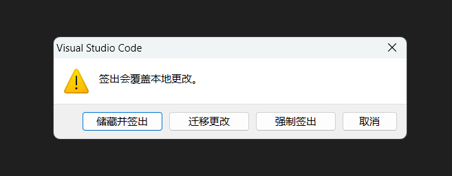
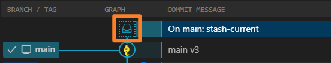
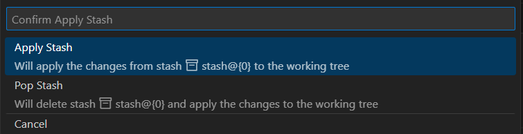

## 前言

平常使用 `git add .` 或者 `git push|pull|clone` 等命令，已经无法满足各种奇怪的需求了，

在使用 Github 的时候，由于对【本地分支】和【远程分支】理解不够深刻，难免会出现各种问题

所以本文章持续记录使用 Git 时遇到的各种复杂场景

## 1 本地分支相关

### 1.1 签出会覆盖本地修改

场景描述：

通常我会在 `dev` 分支上操作，然后细粒度地提交 commit，上传到 github 上形成一个 pull-request，然后 `main` 再接受 pr，合并成一个

但是有时候会忘记切换分支（比如现在就是），直接在 main 上更改

在 vscode 的状态栏就会出现 `*`，此时想换到 `dev` 分支

直接切换会出现



该提示下的三个选项分别是什么意思呢？

1. 储藏并签出：希望【暂存区】仍然在当前分支，然后切换到另一个分支
2. 迁移更改：希望将【暂存区】的内容切换到另一个分支，可能要处理冲突问题
3. 强制签出：（不推荐）直接放弃当前分支（比如 `main`）未提交的 `commmit`，然后切换为分支 `dev`

所以该场景我们需要的是【迁移更改】

### 1.2 暂存 apply 和 pop

什么时候需要【储藏并签出】呢？

比如当自己在 `a-branch` 上写代码，突然有紧急的 bug 需要在 `b-branch` 维修，但是 `a-branch` 还没到达可以提交的阶段，此时就可以使用【储藏并签出】的功能

在修改完以后，回到原先的分支，可以看到 stash 的小图标



此时右键单击该小图标，会弹出如下对话框



那么两个选项有什么区别呢？

- `apply-stash`：合并到当前分支，可以对多个分支使用，删除用 `drop stash`
- `pop-stash`：合并到当前分支并删除，即只能使用一次

Warning: 使用完 stash 后，并没有形成一个提交

该场景下用 `pop-stash` 即可

### 1.2 变基

## 2 远程分支相关

### 2.1 删除远程分支

远程分支已删除，本地仍然保留远程分支，如何清理过期的分支

原因就是本地缓存了远程分支的信息，要删除本地缓存的已删除远程分支，可以使用以下 `git` 命令

```shell
git remote prune origin
```

### 2.2 gitmodules 相关

gitmodule 是第一次遇到，有点抽象的，不过不用管，先酱

删除 `gitmodules`

```shell
# 取消关联
git submodule deinit -f <submodule-path>
# 删除 .gitmodules 文件
rm .gitmodules # linux
del .gitmodules
# 更新 Git 的索引以反映文件的删除
git rm --cached .gitmodules
# 提交
git commit -m "Remove .gitmodules file"
```

## 参考
